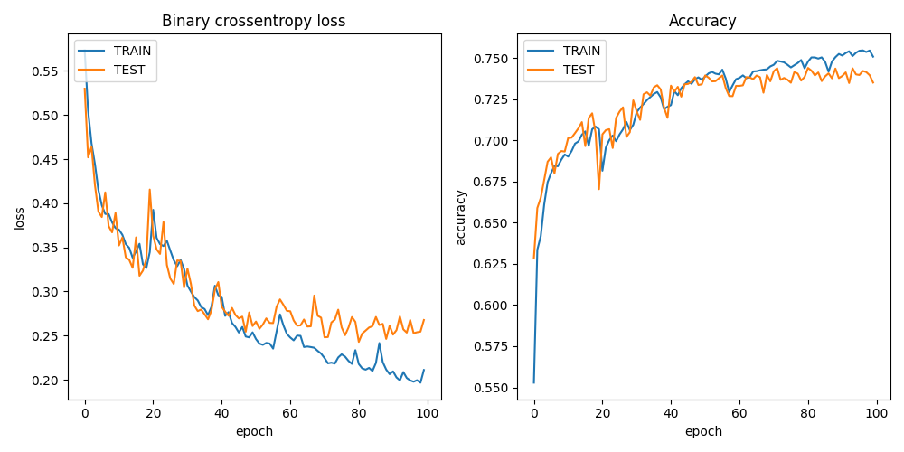

Introduction
============

In this tutorial, we will train a machine learning model to identify water in Sentinel-2 satellite images. 
We will be using code from `this GitHub repo <https://github.com/msoczi/unet_water_bodies_segmentation>`_ using 
this `dataset <https://www.kaggle.com/datasets/franciscoescobar/satellite-images-of-water-bodies/>`_.

First, find a target executor.

.. code-block:: console

    ╭──────────────────┬────────────────────┬────────────────┬─────────────────────╮
    │ NAME             │ TYPE               │ LOCATION       │ LAST HEARD FROM     │
    ├──────────────────┼────────────────────┼────────────────┼─────────────────────┤
    │ icekube          │ container-executor │ RISE, Sweden   │ 2024-02-28 20:05:45 │
    │ dev              │ container-executor │ Rutvik, Sweden │ 2024-02-28 20:05:45 │
    │ leonardo-booster │ container-executor │ Cineca, Italy  │ 2024-02-27 18:50:11 │
    │ lumi-std         │ container-executor │ CSC, Finland   │ 2024-02-28 20:06:01 │
    ╰──────────────────┴────────────────────┴────────────────┴─────────────────────╯

Generate an empty working, targeting the ICEKube K8s cluster. Note that the target executor
can be changed later.

.. code-block:: console

   mkdir waterml
   cd waterml
   pollinator new -n icekube 

.. code-block:: console

   INFO[0000] Creating directory                            Dir=./cfs/src
   INFO[0000] Creating directory                            Dir=./cfs/data
   INFO[0000] Creating directory                            Dir=./cfs/result
   INFO[0000] Generating                                    Filename=./project.yaml
   INFO[0000] Generating                                    Filename=./cfs/data/hello.txt
   INFO[0000] Generating                                    Filename=./cfs/src/main.py

Dataset
=======

Copy the ``water_body_dataset`` to the ``./cfs/data`` directory. 

.. code-block:: console
   
    cp ~/water_body_dataset ./cfs/data/water  

If the dataset is already stored in Colonies CFS, you can copy the dataset directly from CFS to the project directory.

.. code-block:: console

    colonies fs sync /water ./cfs/data/water

The dataset will upload next time the project run and will be available in the container at these directories:

.. code-block:: python

    projdir = os.environ.get("PROJECT_DIR")
    image_path = projdir + '/data/water/Images/'
    mask_path = projdir + '/data/water/Masks/'

Build a Docker container (optional)
===================================

We are going the Container Executor, which comes in three variants. 

1. **Kube Executor** runs containers as Kubernetes batch jobs.  
2. **Docker Executor** runs containers as Docker containers on a baremetal servers or VMs.
3. **HPC Executor** runs containers as Singularity containers on HPC systems, managing them as Slurm jobs.
   
As the *function specification* is identical, meaning that we can easily switch between these 3 types of executors.
To run containers, we first need to create a Dockerfile with the following content: 

.. code-block:: docker

   FROM docker.io/tensorflow/tensorflow:2.13.0-gpu

   RUN apt-get update && apt-get install -y python3 python3-pip wget vim git fish libgl1-mesa-glx libglib2.0-0
   RUN python3 -m pip install --upgrade pip
   RUN pip3 install pycolonies opencv-python tqdm Pillow scikit-learn keras matplotlib numpy

Build and publish the Dockerfile and publish the Docker image at public Docker registry.

.. code-block:: console

   docker build -t johan/hackaton .
   docker push johan/hackaton

The ``johan/hackaton`` Docker image has already been published at DockerHub.

Training the model
==================

Now that we have prepared the dataset and created a Docker container, it's time to proceed with training the model.

Configure the Pollinator project
--------------------------------

.. code-block:: yaml

   projectname: johantest
   conditions:
     executorNames:
     - icekube
     nodes: 1
     processesPerNode: 1
     cpu: 10000m
     mem: 15000Mi
     walltime: 600
     gpu:
       count: 1
       name: "nvidia-gtx-2080ti"
   environment:
     docker: johan/hackaton
     rebuildImage: false
     cmd: python3
     source: main.py

Replace main.py
---------------

Download source code from this `GitHub repo <https://github.com/johankristianss/colonyoshackaton/blob/main/src/main.py>`_.

.. code-block:: console 

    wget -O cfs/src/main.py https://raw.githubusercontent.com/johankristianss/colonyoshackaton/main/src/main.py

Note that the Python code saves the training result and a random prediction example in the result directory, which is
automatically synchronized back to the client after process completion.

.. code-block:: python

    plt.savefig(projdir + '/result/res_' + processid + '.png')
    plt.savefig(projdir + '/result/samples_' + processid + '.png')

.. code-block:: console 

   ls cfs/result

.. code-block:: console 

   .rw-r--r--  55k johan 12 Dec 21:40 res_076e273a1d082dd2886892dfd7d1723e12c747cf2899f2c2ede27ceb55e06ae2.png
   .rw-r--r-- 266k johan 12 Dec 21:40 samples_076e273a1d082dd2886892dfd7d1723e12c747cf2899f2c2ede27ceb55e06ae2.png

Train the model
---------------

Pollinator will automatically synchronize the ``cfs/src``, ``cfs/data``, and ``cfs/result`` directories to Colonies CFS, generate
a *function specification* and then submit the *function specification*, follow the process execution, and upon completion, synchronize the 
project files back to your local computer.
 
.. code-block:: console 

    pollinator run --follow

.. code-block:: console 

   67/67 [==============================] - 1s 18ms/step - loss: 0.3434 - accuracy: 0.7024 - val_loss: 0.3263 - val_accuracy: 0.7038
   Epoch 25/30
   67/67 [==============================] - 1s 17ms/step - loss: 0.3307 - accuracy: 0.7092 - val_loss: 0.3146 - val_accuracy: 0.7121
   Epoch 26/30
   67/67 [==============================] - 1s 18ms/step - loss: 0.3139 - accuracy: 0.7140 - val_loss: 0.2947 - val_accuracy: 0.7249
   Epoch 27/30
   67/67 [==============================] - 1s 17ms/step - loss: 0.3226 - accuracy: 0.7110 - val_loss: 0.3027 - val_accuracy: 0.7244
   Epoch 28/30
   67/67 [==============================] - 1s 17ms/step - loss: 0.2994 - accuracy: 0.7208 - val_loss: 0.2910 - val_accuracy: 0.7259
   Epoch 29/30
   67/67 [==============================] - 1s 17ms/step - loss: 0.2910 - accuracy: 0.7239 - val_loss: 0.2781 - val_accuracy: 0.7261
   Epoch 30/30
   67/67 [==============================] - 1s 17ms/step - loss: 0.2856 - accuracy: 0.7258 - val_loss: 0.2733 - val_accuracy: 0.7313
   23/23 [==============================] - 0s 4ms/step
   
   INFO[0141] Process finished successfully                 ProcessID=61e597845ed3df4456c5be7d358e35141b8dc4c1f76a89d7caad0f31f792106c
   Downloading samples_076e273a1d082dd2886892dfd7d1723e12c747cf2899f2c2ede27ceb55e06ae2.png 100% [===============] (5.0 MB/s)
   Downloading res_076e273a1d082dd2886892dfd7d1723e12c747cf2899f2c2ede27ceb55e06ae2.png 100% [===============] (1.7 MB/s)

We can now open the sample and training plot pictures.

.. image:: img/prediction_example.png 

